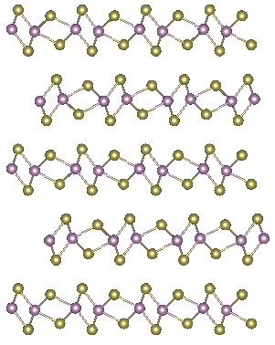

# Introduction

Going from high to low temperatures, Nb​3Br8​ crystals undergo a transition from a paramagnetic material to a nonmagnetic material and experience a shift within its stack of 2-D atomic layers (Pasco et al., 2019). With lower temperatures, Pasco et al.(2019) observes a transition from high to low magnetic susceptibility and structural rearrangement from a two-layer unit cell to a six-layer unit cell. However, the role of stacking faults, or the misalignment of atomic layers, in the magnetic transition remains unknown. To better understand the role of stacking faults, I develop python code that identifies stacking faults within Scanning Transmission Electron Microscopy (STEM) images using Ismail Baggari’s code on gradient analysis with phase maps derived from specific Fourier peaks. To understand the the density of stacking faults, I have also developed code that counts the number of atomic layers in each STEM image.

Being held together by Van der Waals forces, the stack of 2-D layers within Nb​3Br8​ crystals rearranges as the material goes from higher to lower temperatures. Upon cooling the Nb​ Br​ crystal, the material transitions from a paramagnetic to a nonmagnetic material which is accompanied by the shift from a six-layer unit cell to a two-layer unit cell. As mentioned previously, the role of stacking faults within the magnetic transition of the crystal remains unknown. Although stacking faults within STEM images with small fields-of-view can be identified by hand, manually finding the faults becomes difficult with images of larger fields-of- view. With the goal of eventually collecting data regarding the average length of the stacking faults and the layer-density or span of stacking faults, I use multiple methods in Python to identify the location of the stacking faults. The first method involves finding the maximum phase shift between neighboring pixels, and the next uses the gradient.

# Attempting to Upload an Image

 



# Note
I am currently having difficulty uploading images, but there will be 2-3 images for every
project subcategory

# References

"Pasco, C. M. (.1,2 )., et al. “Tunable Magnetic Transition to a Singlet Ground State in a 2D Van Der Waals Layered Trimerized Kagomé Magnet.” ACS Nano, vol. 13, no. 8, pp. 9457–63. EBSCOhost, https://doi-org.proxy.library.cornell.edu/10.1021/acsnano.9b04392. Accessed 31 Mar. 2022."
