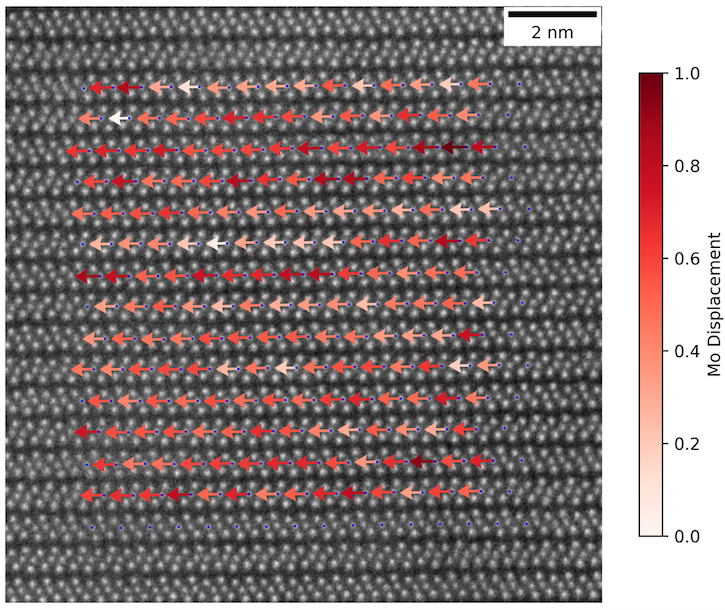

# Understanding the Room Temperature Phase and Phase Transitions of MoTe2

To better understand the room temperature phase of the transition metal dichalcogenide MoTe2, we take cross sectional Scanning Transmission Electron Microscopy (STEM) images of the bulk material at both the many-layer and few-nanometer limit. With these STEM images, we can map the interlayer displacements using image processing techniques in python. Overall, the project is divided into several steps: 1. identify any common stacking displacements across the cross-sectional images, 2. simulate a robust library of plan-view STEM images using this data, and 3. recreate the experimental plan-view STEM images of MoTe2 taken across variable temperatures using the simulated images. With a robust simulated library, we more accurately identify the phase of the material within the experimental plan-view images, taken along its temperature transition from the 1T’ to the Td phase. Doing so will map the path of transition within the material which can then be repeated for samples with varying thicknesses. Although understanding the 1T’ to Td phase transition of the material with varying thicknesses is the overarching goal of this project, the current focus is to identify the common structures of both bulk and few-layer MoTe2 at room temperature.





In the top left, a section consisting of two atomic layers from a STEM image has been cropped. Line profiles of these two layers are shown beneath the image on the top left with arrows pointing to the respective profiles. The reference molybdenum atoms are circled in the line profiles. The image to the right
indicates a model of MoTe2 in both its phases. The purple atoms are molybdenum and the yellow atoms
are tellurium.

# Progress on Project

To identify displacements using cross sectional images, I use Fourier methods to partition the image
into atomic layers. Within each atomic layer, I distinguish between the molybdenum atoms and the
tellurium atoms. With this information, it becomes possible to identify each individual atoms
using line profiles and refine their positions using various fitting methods: gaussian fitting,
center of mass fitting, and using Voronoi regions. In the cross-sectional STEM image of room temperature MoTe2, the identified reference molybdenum atoms (plotted as blue dots) and interlayer displacements (plotted as colored arrows) are displayed below.  





To simulate the a plan view STEM image of interlayer displacements, I use a program known as
MuSTEM, where 3-D atomic coordinates are inputted, and a HAADF (High Angle Annular Dark Field)
image is simulated. The number of layers are specified, and I implement rotation of the
atomic coordinates to observe the image along the [100] axis in plan-view. An example of a
simulated image of the lower temperature Td phase in plan-view is shown below.

<!-- 

 -->

The issue regarding the phase identification of the plan-view images is an ongoing process.
My current focus is on using average line profiles within the plan-view images. With the line
profiles from experimental data, I use curve-fitting to identify various linear combinations of profiles, taken from simulated images, that yield results similar to experimental data.  
