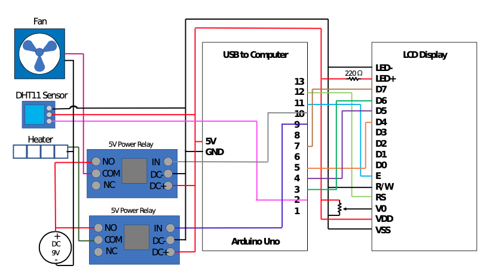
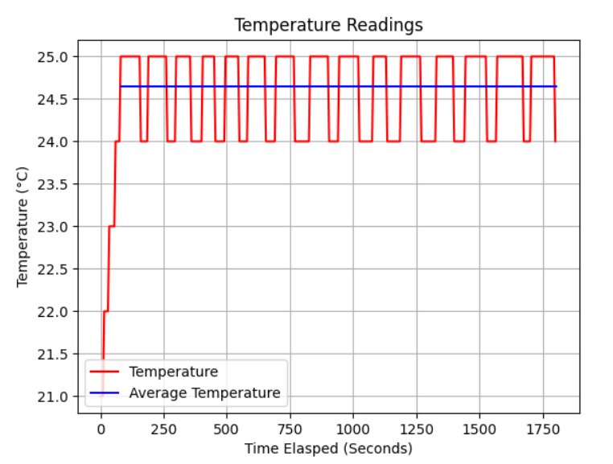

# Introduction

Data acquisition, or the collection of real-world measurements and conversion into digital data, has many applications within daily life and research. When performing an experiment, it is essential to regulate laboratory conditions and helpful to automate the data collection process to reduce sources of error. To explore data acquisition, this project focuses on using the Arduino Uno to monitor temperature, manage an external fan and heating pad based on the temperature readings, and display data on to an LCD display. To test the ability of the heating and cooling system, temperature data was collected and averaged over a thirty-minute period and compared to the desired temperatures of 20°C and 25°C. Removing the need for manual adjustments, this setup is meant to serve as a small-scale example of how the Arduino Uno is used to automate a temperature regulating system. This apparatus can be used to thermally regulate smaller volumes that do not require immediate response.

# Experimental Setup

The apparatus used for this project consists of several components: an LCD display, two power relays, an external 9V power supply, a fan, a heater, a DHT11 temperature sensor, and of course, the Arduino Uno. Here, the power relays act as electronic switches in tandem with the external power supply. The key components of the system include the actuators, or the fan and heater, the temperature sensor, and the Arduino Uno which assumes the role of data acquisition hardware. A circuit diagram of the system along with the wiring for the essential components is shown below.




A diagram of the wiring within the apparatus is shown. The main components of the system include the Ar- duino Uno board with its 13 digital I/O pins, the LCD display with its variety of pins, the two power relays connected to a fan and a heater, an external voltage source, and the DHT11 sensor.

The apparatus is left to run for two thirty-minute periods to maintain different desired temperatures: 20°C and 25°C. After leaving the DHT11 monitor to sit for ten minutes undisturbed, the ambient room temperature is measured to be at 21°C. Thus, the goal is to observe how well the system could maintain readings below and above the ambient room temperature. For each thirty- minute period, the temperature sensor collects readings once every five seconds. Since the time delay between readings should be no shorter than one second, I use a delay of five seconds to help ensure that the local temperature has had time to equilibrate. The data is then stored using CoolTerm software and uploaded to python where the average temperature is computed. Since the goal is to observe how well the apparatus can maintain the desired temperature, only data points that occurred after the initial reading of the desired temperature are considered for computing the average temperature.

# Results
When the setup is instructed to maintain a temperature of 25°C from a starting temperature of 21°C, the resulting temperature readings over a period of around thirty minutes are shown in Fig. 3. The average temperature, across the data points that occurred in between the initial reaching of 25°C and the remaining duration of time, is 24.6°C with an average uncertainty of ±2°C. The average temperature indicates that the heating pad does a decent job at maintaining the temperature of the local environment even with a slower sampling period of five seconds. Due to the 1°C resolution of the sensor [4], the changes in temperature appear to occur in discrete steps. If the sensor has a higher resolution and faster sampling rate, I suspect the heating curve would take on a continuous form. During the oscillation between 25°C and 24°C, the system is continually turning the heating element on at 24°C and off at 25°C. When the heating element is disabled, the system naturally cools due to the lower ambient room temperature which then triggers the heating element to restart. This cycling continues for the remaining time that the system is active.




Temperature readings over a thirty minute period, with a set temperature threshold of 25°C, are plotted in red. There is an initial warming period before the temperature consistently oscillates between 25°C and 24°C. The average temperature after the initial warming period is 24.6°C ±2°C and is plotted in blue.
