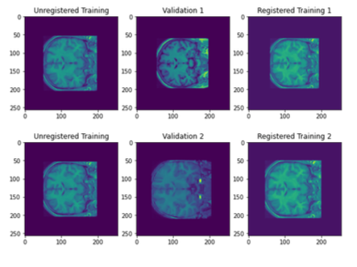
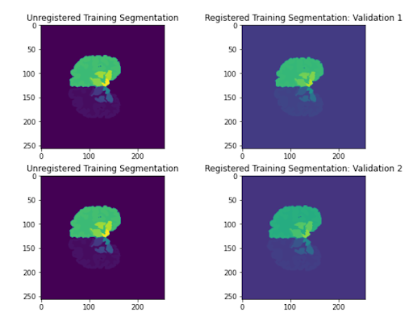

# Medical Image Processing and Image Registration

Within medical image processing, the process of image registration remains essential for the automated analysis of medical images. By comparing a set of experimental medical images to an established set of templates, the experimental images can undergo semantic segmentation- or the process of dividing the image into a set of various regions with established labels. In this project, I explore the application of image registration and segmentation on the coronal sections of the brain- indexed from a larger set of test fMRI images. The field of medical image processing remains especially important to realize the capability of processing large sets of fMRI data which has far-reaching research applications in medicine. Since the semantic labeling of portions of the fMRI scans provides the efficient identification of the anatomy displayed within an image, the automated process could, for example, pave the way for improved research on the development of the human brain over time by tracking the changes in each anatomical feature of the brain. By tracking the development of the human brain using fMRI data, it becomes possible to understand the specific changes that occur within each portion of a patient’s brain under the condition of brain disease- allowing for better treatment and diagnosis. Since manual segmentation procedures require the expertise of a worker, it is prone to human error, poor accuracy, and adds both timely and monetary expenses. In particular, it would be difficult for the manual segmentation to process vast amounts of MRI data in a timely fashion. With these issues in mind, it is particularly important to improve the accuracy of the automatic segmentation procedures to consistently yield more accurate results and save monetary expenses.

To better understand the utilization of semantic labeling and registration of fMRI images, I implemented my own methods for image registration and applied these functions to a set of fMRI images. Elaborating on the methods, I first implement a procedure that optimizes the similarity transformation parameters which maintain the overall shape of the object. With image registration, the training images, or templates, are mapped onto the experimental images. Starting with similarity transformations, I later improve this method by incorporating affine transformations which allow for the altering of the initial shape of the object- resulting in more parameters for optimization. Once the image registration is complete, I use majority voting-based label fusion on the set of training images to generate a segmentation image for the particular testing image. The segmentation image will include semantic labels associated with every pixel value; for example, pixels valued at 42 of the segmented brain scans will correspond to the region of interest that carries the label of the Right-Cerebral-Cortex.




(Above) All of the images represent the coronal slice of an fMRI data set. The three columns of images, right to left, describe the untransformed training image, the testing image, and the optimal transformed training image- such that it best represents the desired image. The two rows display the registration of the same training image on two different testing images. Upon viewing the left-most column, the transformed images display different scaling to best suit the respective desired images.

# Procedure

Summarizing my initial results, I implement several functions that allow for the optimization of transform parameters for rotation, scaling, translation in both x and y to map the training image onto the testing image. Constructing the transformation function, I apply a rotation to a mesh grid and create an interpolation function for the mesh grid using the original image. Modifying the rotation element to include scaling, I multiply both the X and Y-axis by a general scaling factor ‘a.’ The overall algorithm goes as follows: transform the training image using default values for the parameter, compute the sum of squared differences (loss function) between the registered training image and the desired testing image, and optimize the transformation parameters such that the loss function is at a minimum.

Since each fMRI training image corresponds to an established template that describes different parts of the brain with various pixel intensities,  I apply the same optimal transformation parameters, taken using the process described above, and apply them to the labeling templates for each training image. With a set of registered templates, I use majority voting-based label fusion to reconstruct a new labeling template for the particular desired image. For every pixel in the desired image, the mode of the corresponding pixel intensity values is taken from a set of transformed training images and assigned to the pixel at the original location. An example of this segmentation procedure is shown below. For this project, there are six registered training images used for each of the nine testing images.




(Above) The segmentation image for the same training image is shown in the left column of images. The segmentation image is then transformed with the optimal parameters used to transform their corresponding fMRI scans to best fit a testing image- shown on the right column.

Building off of these foundations, there are several improvements to the transformation function that I implement. While the previous transformation function only allows for similarity, or shape-preserving, transformations, I implement a new parameter for shearing in the x and y-direction for affine, or non-shape preserving, transformations. Originally, I implement this addition by modifying the transformation applied to the X and Y-axis with Sy being the factor that shears the image vertically and Sx shearing the image horizontally. Including the shearing parameters, the optimization function would be given two additional transformations which would allow for more configurations of the training images and an improvement on the prior procedure.
