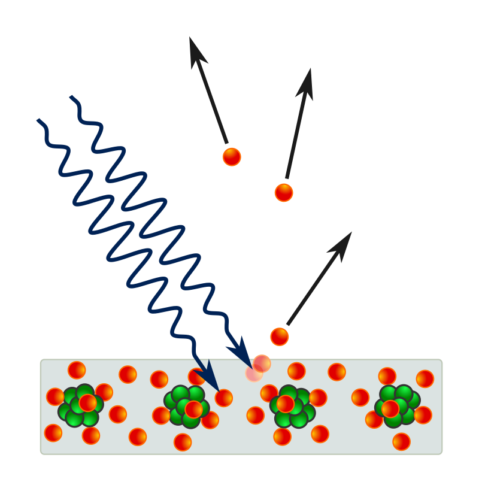
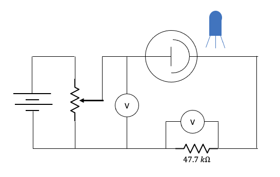
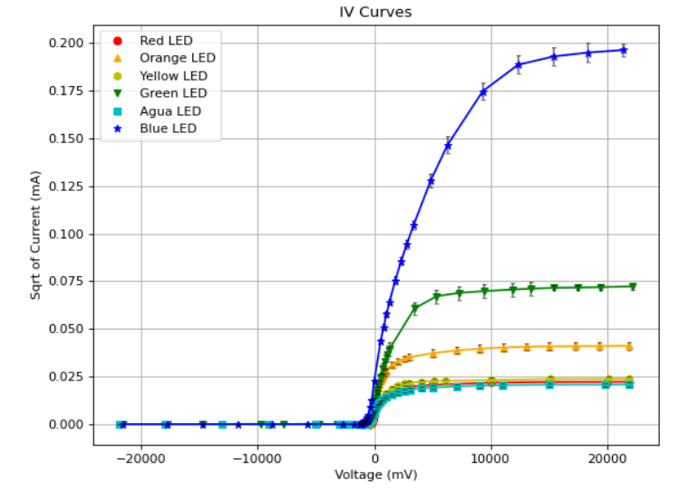

# Understanding the Photoelectric Effect

The photoelectric effect refers to the process where solids emit electrons upon being illuminated by light with a frequency beyond a certain threshold. Understanding the photoelectric effect is essential as it serves as evidence for the quantum nature of light, or the description of light as discrete particles known as photons. To study the photoelectric effect, I obtain multiple IV curves for various frequencies of light by varying the applied voltage across the a photomultiplier tube. I then use linear fitting for points within the IV curve near the x-axis to identify stopping voltages. In doing so, I seek to verify the ratio of h/e, where h refers to Planck’s constant and e to the elementary charge, and to identify the contact potential within the phototube. By calculating the slope of a stopping voltage versus frequency plot, I obtain an approximate ratio of h/e of (4.982 ± 0.747)E-15 Vs which has around a 21% error compared to the theoretical value he = 4.136E-15 Vs. Observing the y-intercept of the stopping voltage versus frequency plot, I also report a contact potential of (1.961 ± 0.286) V.




A diagram illustrating the photoelectric effect is shown above. Incoming photons shown as the blue waves eject electrons shown as the red balls from the surface of the metal. This image was taken from: https://en.wikipedia.org/wiki/Photoelectric_effect#/media/File:Photoelectric_effect_in_a_solid_-_diagram.svg.

# Experimental Setup

To obtain a fit for the linear relationship shown in equation (2), multiple IV curves for each correspond- ing frequency of light need to be obtained. The IV curves are taken using the setup shown below. where
the LED shown in blue is cycled through multiple col- ors: red (624 ± 6.7)nm, orange (605 ± 7.0)nm, yellow (590±7.0)nm, green (525±12.5)nm, aqua (505±12.5)nm, blue (467 ± 12.73)nm. It should be noted that the un- certainties for the LEDs for the red, yellow, green, and blue are obtained using the half width half max of the spectral distributions. For orange and aqua, this information is not provided, but the uncertainties for yellow and green are used correspondingly. The LEDs are positioned such that the exposed surface area is maximized on the cathode plate is and minimized on the anode. These adjustments for the positioning are essential to minimize the negative anode current. To minimize anode exposure to the LED light as well as prevent ambient light from interfering, a cover with a slit is placed over the phototube, and the apparatus is enclosed in a cardboard box. A variable resistor is used to adjust the applied voltage to the circuit and measured with a voltmeter. Since the photocurrent tend be on the scale of 10−8 milliamps, a voltmeter in combination with 47.7KΩ resistor is used to detect the current. Obtaining an IV curve, the applied voltage is swept between -22.5V and 22.5V starting with a large negative bias to measure the residual back current from the anode. In addition, the phototube is grounded between switching LEDs to prevent charge buildup on the electrode plates.




A diagram illustrating the apparatus for the photoelectric effect is shown above.

# Sample of Results

Within the phototube, photons emitted by the LED are absorbed by the electrons within the cathode. Photo electrons are then ejected and may flow to the anode. Thus, only by shining light above the cutoff frequency will the circuit be completed, and current be allowed to flow. By applying a reverse bias, the voltage difference will work against the photocurrent, diminishing the magnitude of current as shown below. Applying a forward bias eventually results in saturation of the photocurrent, demonstrated by the plateauing of the curves at higher voltages in the figure below. The magnitude of saturated photocurrent is proportional to the intensity of light reaching the surface of the cathode plate. It should be noted that, upon using an infrared LED, there is no photocurrent response as the frequency is below the cutoff.




Various IV curves for the circuit using different wavelengths of light are shown above.
